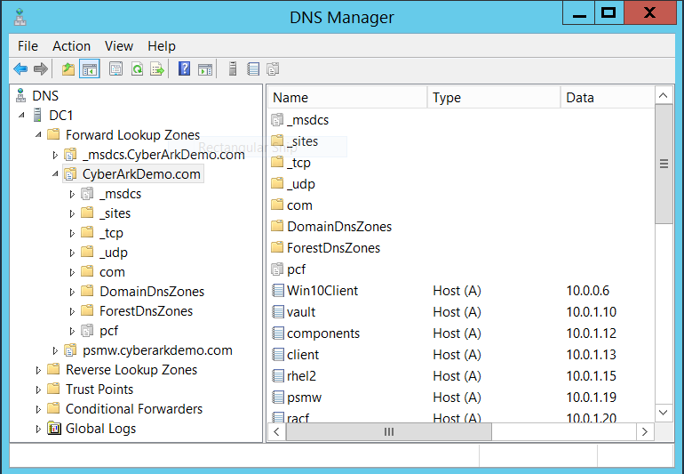
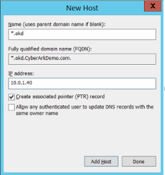
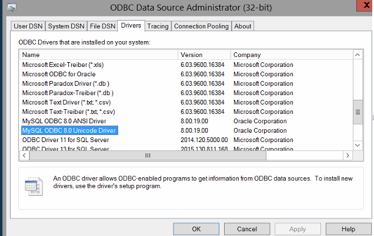
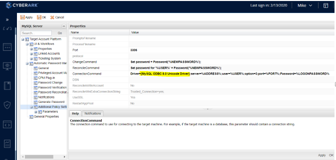

# Prerequisite: Environment Setup
This section describes how to setup the environment for this tutorial

## Setup CyberArk CorePAS based on CGD

This tutorial is based on 4 virtual machines (`DC`, `VAULT`, `COMP` & `CLIENT`) from  [CGD](https://ca-il-confluence.il.cyber-ark.com/display/gpse/CGD+-+20200101#/)
Note the lab was built with CGD-2020-0101-GA but should work with other versions or CorePas v11.1 as well.

Please refer to [confluence](https://ca-il-confluence.il.cyber-ark.com/pages/viewpage.action?pageId=285087892&preview=%2F285087892%2F297248443%2FCGD-Stand-Alone-Skytap-Demo-QuickStart_2019_1001.pdf) for detailed setup

## Setup 2 Extra VM (DAP Master & OKD)

We will setup 2 more VMs for this tutorial.  One as DAP Master instance and another one for executing OKD.

1. Download `040-OKD.7z` and `041-DAP-MASTER` from `/apj/Conjur-OpenShift-Workshop-20200221` folder in Smartfile.
2. Extract both files to your laptop (VM Host)
3. In the extracted folders, double click `040-OKD.vmx` & `041-DAP-MASTER.vmx` to import them to VMWare workstation.
4. Power on 4 VMs from CorePAS (`DC`, `VAULT`, `COMP` & `CLIENT`)
5. Login to `DC` VM
6. Start `DNS Manager` by clicking `DNS` shortcut on taskbar
7. Browse to `DNS > DC1 > Forward Lookup Zones > CyberArkDemo.com`

7. Right-click `CyberArkDemo.com` and click `New Host (A or AAAA) to create the following DNS records

DNS record | IP Address
-----------|-----------
*.okd|10.0.1.40
docker03|10.0.1.41
master-dap|10.0.1.41
mysql01|10.0.1.41

8. Logoff `DC` VM
9. Start `DAP-MASTER` and `OKD` VMs

## Onboard MySQL Account to CorePAS

We are going to manage & secure a database secret.   Let's onboard the MySQL database credentials to CorePAS.  You can also refer to https://docs.cyberark.com/Product-Doc/OnlineHelp/PAS/Latest/en/Content/PASIMP/MySQLServerPlugin.htm

### Install & Configure MySQL Driver
1. Log in to `COMP` VM as CYBERARKDEMO\administrator
2. Browse to https://dev.mysql.com/downloads/file/?id=492345
3. Click `No thanks, just start my download` to start downloading 32-bit MySQL ODBC driver
4. Double click the downloaded msi file to start installation
5. Click `Start` to search for `ODBC Data Source Administrator (32-bit)`
6. Browse to `Driver` tab and make sure MySQL are installed

7.Logoff

### Create MySQL account in PVWA
1. Log in to `CLIENT` as `CYBERARKDEMO\Mike`
2. Start `Chrome` and access PVWA by clicking `PAS` on the bookmark bar
3. Select `Active Directory / LDAP` and login as `Mike`
4. Create a new safe called `appaccts`
5. Create an account called `app-cityapp`

Address: mysql01
Port: 3306
Username: cityapp
Initial Password: Cyberark1
Database: world

6. Try verify and change the password

## Setup DAP Master

1.	Load conjur image
2.	Start conjur container
3.	Configure DAP with signed certificate

## Configure Vault Synchronizer
